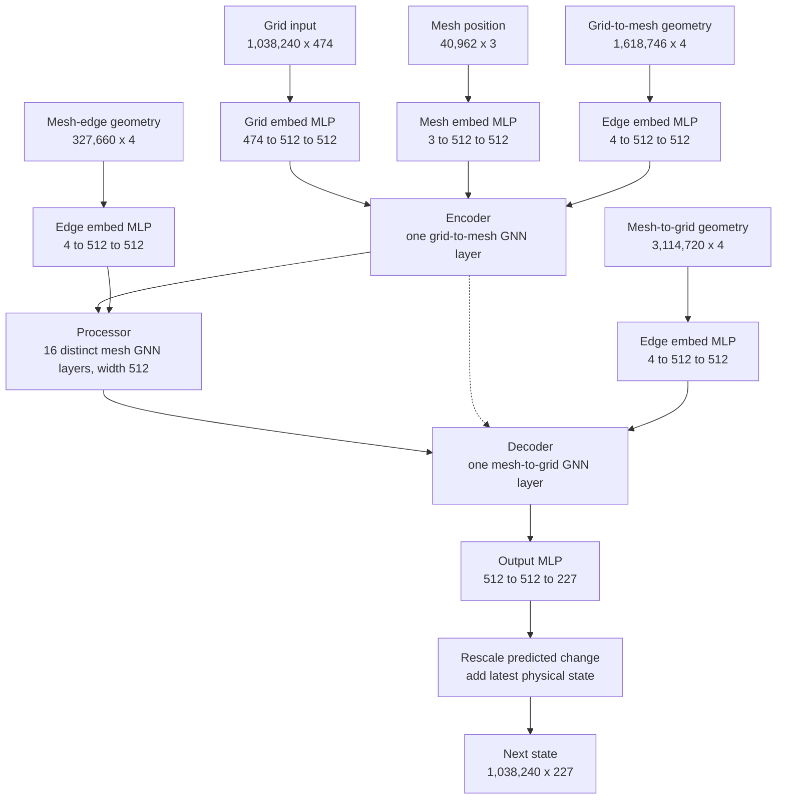

# GraphCast: architecture, data dimensions, and inference

**Paper:** Lam et al., *Learning skillful medium-range global weather forecasting*, *Science* 382 (2023), 1416–1421. [DOI](https://doi.org/10.1126/science.adi2336) · [Full paper and supplement](https://arxiv.org/html/2212.12794v2). This guide describes the paper's **0.25° / 37-pressure-level GraphCast** model. Other released checkpoints have different shapes.

## 1. The model in three equations

With a six-hour time step, let $X_t$ contain the global variables GraphCast predicts. Its one-step forecast is

$$
\hat X_{t+6}=X_t+\Delta_\theta(X_{t-6},X_t,F_{t-6},F_t,F_{t+6},C).
$$

$F$ holds known time-varying forcings, and $C$ holds static geographic features. The neural network estimates a **residual** $\Delta_\theta$, not a complete state from scratch. During inference, the same step runs in a loop:

$$
(X_{a},X_{b})\leftarrow(X_{b},\hat X_{b+6}),\qquad b\leftarrow b+6\text{ h}.
$$

There are **40 iterations** for a ten-day forecast. The architecture below describes **one iteration**; its weights are reused at every iteration. [Paper, Fig. 1 and Supplement §3.1](https://arxiv.org/html/2212.12794v2)

## 2. Complete data and variable inventory

### Spatial and time dimensions

| Symbol | Meaning | Size in the paper model |
|---|---|---:|
| $N_{lat}$ | Latitude samples, $-90°$ through $90°$ | 721 |
| $N_{lon}$ | Longitude samples, spaced by $0.25°$ | 1,440 |
| $N_g$ | Grid columns, $721\times1,440$ | **1,038,240** |
| $N_p$ | Atmospheric pressure levels | **37** |
| $T_{in}$ | Dynamic input times, $t-6$ h and $t$ | 2 |
| $T_F$ | Forcing times, $t-6$ h, $t$, and $t+6$ h | 3 |
| $N_m$ | Finest icosahedral mesh nodes | **40,962** |
| $d$ | Learned node/edge latent width | **512** |

The 37 pressure levels, in hPa, are: **1, 2, 3, 5, 7, 10, 20, 30, 50, 70, 100, 125, 150, 175, 200, 225, 250, 300, 350, 400, 450, 500, 550, 600, 650, 700, 750, 775, 800, 825, 850, 875, 900, 925, 950, 975, 1000**. A pressure level is an equal-pressure surface, not a fixed geometric altitude. [Paper, Table 1 and Supplement §§1.1, 3.3](https://arxiv.org/html/2212.12794v2)

### Every dynamic variable the model predicts

| Variable in ERA5 / paper | Symbol | Levels or location | Fields per grid point | Role |
|---|---|---|---:|---|
| 2 metre temperature | `2t` | Surface | 1 | Input and prediction |
| 10 metre eastward wind component | `10u` | Surface | 1 | Input and prediction |
| 10 metre northward wind component | `10v` | Surface | 1 | Input and prediction |
| Mean sea-level pressure | `msl` | Surface | 1 | Input and prediction |
| Six-hour total precipitation | `tp` | Surface | 1 | Input and prediction |
| Air temperature | `t` | 37 pressure levels | 37 | Input and prediction |
| Eastward wind component | `u` | 37 pressure levels | 37 | Input and prediction |
| Northward wind component | `v` | 37 pressure levels | 37 | Input and prediction |
| Geopotential | `z` | 37 pressure levels | 37 | Input and prediction |
| Specific humidity | `q` | 37 pressure levels | 37 | Input and prediction |
| Vertical velocity | `w` | 37 pressure levels | 37 | Input and prediction |
| **Total** | | $5+6\times37$ | **227** | |

Each *state* has $721\times1,440\times227=235,680,480$ dynamic scalar values. For example, `z500` means geopotential at 500 hPa; `t850` means temperature at 850 hPa. The paper's 1,380-target headline scorecard evaluates a **subset** of these fields and excludes `tp`, even though the model predicts it. [Paper, Table 1 and verification methods](https://arxiv.org/html/2212.12794v2)

### Every additional variable used as context

| Feature | Symbol / representation | Time samples | Per-grid-node feature count | Predicted? |
|---|---|---:|---:|---|
| Top-of-atmosphere incident solar radiation, accumulated over one hour | `tisr` | 3 | 3 | No; known forcing |
| Local time of day | sine and cosine | 3 | 6 | No; known forcing |
| Progress through the year | sine and cosine | 3 | 6 | No; known forcing |
| Land–sea mask | `lsm` | Static | 1 | No |
| Geopotential at the surface / orography | surface `z` | Static | 1 | No |
| Latitude | cosine of latitude | Static | 1 | No |
| Longitude | sine and cosine | Static | 2 | No |
| **Context total** | $5\text{ forcings}\times3+5\text{ static}$ | | **20** | |

The surface `z` in the last table is a fixed terrain feature; atmospheric `z` in the preceding table is a different, predicted field at 37 pressure levels. GraphCast also gives each **mesh node** three geographic inputs (cosine latitude, sine longitude, cosine longitude) and each **graph edge** four geometric inputs (edge length and a three-component relative displacement in the receiver's local frame). These are graph features, not extra weather variables. [Paper, Supplement §§1.1, 3.3](https://arxiv.org/html/2212.12794v2)

### Shape accounting for one forecast step

The following is a **conceptual dense layout** for one forecast example; the official `xarray` code keeps variables in separately named arrays rather than requiring one physical tensor in this exact order.

| Data | Shape | Count per grid node |
|---|---|---:|
| Surface history | `[2, 721, 1440, 5]` | $2\times5=10$ |
| Atmospheric history | `[2, 721, 1440, 37, 6]` | $2\times37\times6=444$ |
| Known forcings | `[3, 721, 1440, 5]` | $3\times5=15$ |
| Static grid context | `[721, 1440, 5]` | 5 |
| **Concatenated grid-node input** | **`[1,038,240, 474]`** | **$10+444+15+5=474$** |
| One predicted residual / next state | `[721, 1440, 227]` | 227 |

For multiple forecast examples, add a leading sample/batch dimension. The 474-feature count describes the paper's grid-node representation, not the number of named dataset variables. [Paper, Supplement §3.3](https://arxiv.org/html/2212.12794v2)

## 3. Architecture: exact layer path for one six-hour step

**How to read this diagram:** there are five separate embedding MLPs, one for each node or edge type. The grid-to-mesh encoder passes information from grid nodes to mesh nodes. The processor communicates *only over the mesh*. The mesh-to-grid decoder returns information to each grid node. The output MLP yields 227 numbers per grid node. Each MLP has one hidden layer of width 512 and uses Swish; LayerNorm follows the MLPs except the final output MLP. Internal updates have residual connections. The 16 processor GNN layers have **different weights**, while the whole one-step model reuses its weights across forecast times. [Paper, Supplement §§3.4–3.7](https://arxiv.org/html/2212.12794v2)

### Graph structure and learned tensor sizes

| Graph object | Count | Raw features each | Embedded / updated features each | What it connects |
|---|---:|---:|---:|---|
| Grid nodes | 1,038,240 | 474 | 512 | One atmospheric column per lat/lon point |
| Mesh nodes | 40,962 | 3 | 512 | Icosahedral mesh positions |
| Grid → mesh directed edges | 1,618,746 | 4 | 512 | Nearby grid columns to mesh nodes |
| Mesh → mesh directed edges | 327,660 | 4 | 512 | Local and long-distance multimesh links |
| Mesh → grid directed edges | 3,114,720 | 4 | 512 | Three face vertices to each grid point |

The mesh is a six-times-refined icosahedron. The processor uses the **union of edges from refinement levels 0–6**, so some edges communicate locally while coarser-level edges bridge longer distances. The mesh has far fewer nodes than the grid and avoids the grid's crowding near the poles. The listed edge counts are for the paper model; they are graph connectivity sizes, not the number of forecast variables. [Paper, Fig. 1 and Supplement §3.3](https://arxiv.org/html/2212.12794v2)

### What a message-passing layer computes

For a directed edge $s\rightarrow r$, with edge feature $e_{sr}$ and 512-dimensional sender and receiver node features $h_s,h_r$:

$$
m_{sr}=\operatorname{MLP}_{edge}([e_{sr},h_s,h_r]),
$$

$$
a_r=\sum_{s\in\mathcal N(r)}m_{sr},\qquad
h'_r=h_r+\operatorname{MLP}_{node}([h_r,a_r]).
$$

In the encoder and processor, the edge feature also receives a residual update, $e'_{sr}=e_{sr}+m_{sr}$. Here brackets mean feature concatenation and $\mathcal N(r)$ is the set of nodes sending messages to $r$. The encoder, each processor layer, and the decoder use this pattern on **different edge sets**. This is why graph connectivity controls which locations can exchange learned information. For the encoder's grid nodes, the update has no incoming-edge aggregation; for the decoder, mesh nodes are not updated again. [Paper, Supplement §§3.4–3.6](https://arxiv.org/html/2212.12794v2)

### Normalization and residual output

$$
\tilde x_j=\frac{x_j-\mu_j}{\sigma_j},\qquad
\Delta x_j=\sigma_{\Delta,j}\,r_j,\qquad
\hat x_{t+6,j}=x_{t,j}+\Delta x_j.
$$

$j$ denotes a variable and, for atmospheric variables, a pressure level. The first expression standardizes inputs using historical statistics; $r_j$ is the output MLP's normalized residual; $\sigma_{\Delta,j}$ is the stored standard deviation of six-hour differences. These statistics must match the checkpoint. The official normalization wrapper handles this path; do not normalize the same arrays twice. [Paper, Supplement §3.7](https://arxiv.org/html/2212.12794v2)

## 4. Inference as one loop

At the first pass, both dynamic states come from analysis/reanalysis data. Later passes reuse the model's prior predictions. The forcings are supplied for each time, including future time-of-day/year and top-of-atmosphere radiation, because they are computable without knowing future weather. The model is **deterministic**: one input pair produces one forecast trajectory. [Paper, Supplement §§3.1, 3.3](https://arxiv.org/html/2212.12794v2)

**Before interpreting a run:** match the checkpoint's grid, pressure levels, variable names, units, time coordinates, data source, and normalization statistics. The official release has `GraphCast` (paper model: 0.25°, 37 levels), `GraphCast_small` (1°, 13 levels), and `GraphCast_operational` (0.25°, 13 levels, fine-tuned for HRES inputs). The output shape and required inputs depend on that choice. The [official README](https://github.com/google-deepmind/weathernext/blob/main/docs/weathernext1_graph/README.md) points to the [demo notebook](https://github.com/google-deepmind/weathernext/blob/main/graphcast_demo.ipynb), checkpoint data, and the solar-radiation helper. Its code is the reference for runnable API calls.

## 5. How the paper established the result

GraphCast learned from **ERA5 reanalysis**, which combines observations with a numerical weather system into a global historical dataset. Development used 1979–2015 training data and 2016–2017 validation data; the headline 2018 test used a final model trained through 2017. The loss averaged squared error across forecast times, grid cells, variables, and levels, with cell-area and variable/level weights. Training gradually lengthened its autoregressive objective from one to **12 steps**, or three days. It took about four weeks on 32 Cloud TPU v4 devices. Loading its pretrained weights for inference does **not** repeat that training. [Paper, GraphCast and Supplement §§4–5](https://arxiv.org/html/2212.12794v2)

Against ECMWF's operational deterministic **HRES** system, GraphCast had lower RMSE on **90.3% of 1,380** evaluated variable/level/lead-time targets in the 2018 scorecard; 89.9% were statistically significant by the paper's test. It made a ten-day forecast in **under one minute on one Cloud TPU v4** after training. The authors also examined cyclone tracks, atmospheric rivers, and extreme temperatures. They aligned evaluation times and data-assimilation windows so the methods had comparable access to observations. [Paper, verification and severe-event results](https://arxiv.org/html/2212.12794v2)

The result needs context. The 1,380-target scorecard omits precipitation because ERA5 precipitation has known biases. HRES used finer resolution and a different numerical approach. GraphCast's mean-square-error training can make long-range predictions smoother, and a single deterministic trajectory does not express uncertainty as an ensemble does. It also depends on good initial analyses, which in turn rely on traditional observations and data assimilation. For inference, these limits matter when judging storm details or comparing a run with another forecast system. [Paper, verification and conclusion](https://arxiv.org/html/2212.12794v2)
